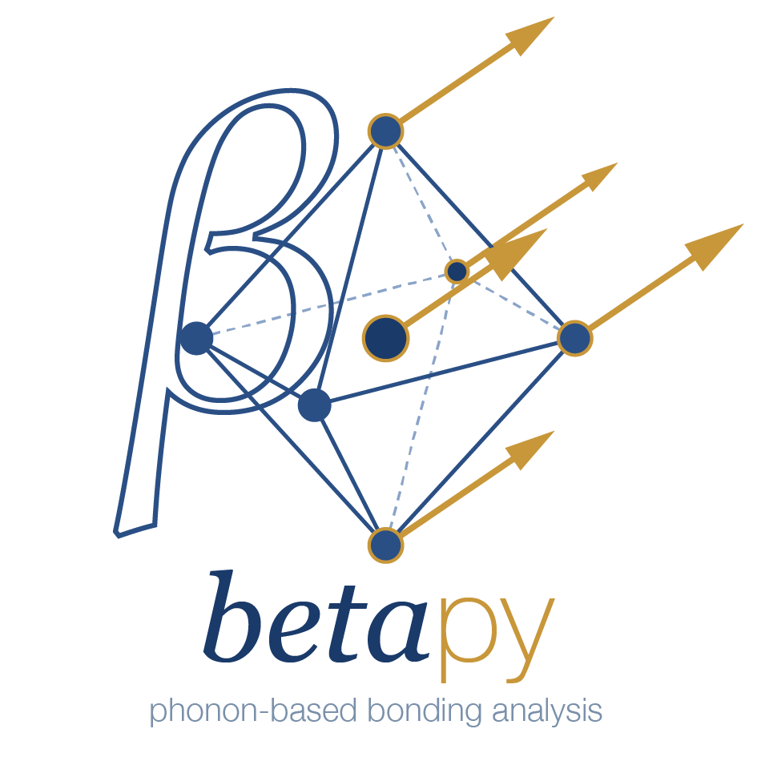
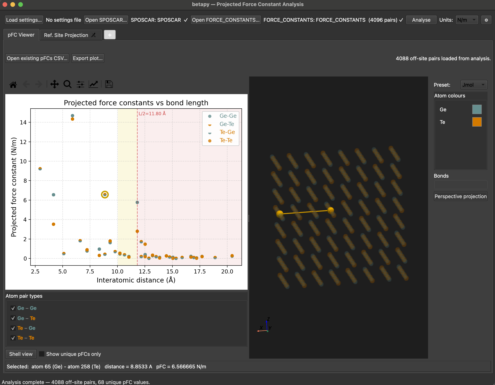

<p align="center">
  
</p>

# betapy

**betapy — phonon-based bonding analysis for crystalline materials**

betapy post-processes the force constants calculated by [Phonopy](https://phonopy.github.io/phonopy/) to extract projected force constants (pFCs) along interatomic bond vectors which can serve as descriptors for bond stiffness or strength. It provides a complementary way of bonding analysis to wavefunction-based approaches and has been used successfully to detect longer range multicenter bonding effects in phase-change materials and beyond.

---

## Features

### Main Features
- **Bulk pFC analysis** - project force constants along all interatomic bond vectors; identify and tabulate unique pFC values per bond type
- **Interactive GUI** — scatter plot of pFC vs bond length with click-to-highlight; 3D structure viewer with Jmol/VESTA colour presets (80+ elements covered), automatic bond drawing, per-species-pair bond toggles, and non-blocking refsite analysis with progress indicator; multi-tab layout with browser-style "+" button for opening additional viewers
- **Shell view** — toggle the scatter plot between individual bond points and aggregated distance shells; each shell shows the mean pFC with a min/max range bar and is sized by bond count; clicking a shell highlights all bonds from the representative source atom in 3D
- **Unit toggle** — switch between eV/Ų (native) and N/m (×16.022) in the GUI toolbar; preference is remembered across sessions; `--unit` flag and `unit:` YAML key available for CLI and settings-file workflows
- **Settings-file workflow** — YAML settings file with CLI flag overrides, following the Phonopy convention

The interactive GUI provides a scatter plot of pFC vs bond length alongside a 3D structure viewer — clicking any data point highlights the corresponding bond:



### Experimental Features

These features implement methods described in a forthcoming manuscript. They are fully functional and actively used in ongoing research, but their scientific basis has not yet been formally published.

- **Reference-site projection** — project force constants around any fractional coordinate in the cell (vacancy, interstitial, or arbitrary point); does not need to coincide with an atom
- **Stiffness-shift parameter** — compare pFC sums between two structures (e.g. intercalated vs deintercalated) using position-based atom matching across structures; falls back to distance-ordered equal-count comparison if matching fails
---

## Requirements

- Python 3.8 or later
- [Phonopy](https://phonopy.github.io/phonopy/) — for generating `SPOSCAR` and `FORCE_CONSTANTS` inputs
- **Core dependencies** (installed automatically): `numpy`, `pandas`, `pyyaml`, `scipy`, `tqdm`
- **GUI dependencies** (optional, see Installation): `matplotlib`, `PyQt5`, `PyVista`, `pyvistaqt`

---

## Installation

**CLI only** — core analysis and all command-line features, no GUI dependencies:

```bash
git clone https://github.com/JanHempelmann/betapy.git
cd betapy
pip install -e .
```

**With GUI** — adds matplotlib, PyQt5, PyVista, and pyvistaqt for the interactive interface:

```bash
git clone https://github.com/JanHempelmann/betapy.git
cd betapy
pip install -e ".[gui]"
```

> **PyVista on conda:** VTK (required by PyVista) installs more reliably from conda-forge. If you use a conda environment, install the VTK stack first:
> ```bash
> conda install -c conda-forge pyvista pyvistaqt
> pip install -e ".[gui]"
> ```

If GUI dependencies are not installed, `betapy-gui` will print a friendly error and exit. The `betapy` CLI works without any GUI packages.

---

## Inputs

betapy reads standard Phonopy output files directly:

| File | Description |
|------|-------------|
| `SPOSCAR` | Phonopy supercell structure |
| `FORCE_CONSTANTS` | Phonopy force constant matrices |
| `REFPOS` | Reference site positions (betapy-specific, see below) |

### REFPOS format

```
v_Li              ← label (any string)
  1               ← number of sites
Direct
  0.0807  0.0417  0.1118   ← fractional coordinates, one per line
  .....                    ← more coordinates are supported, following VASP's POSCAR format
```

The reference site does not need to coincide with an atom — it can be a vacancy, interstitial, or any point of interest in the cell.

---

## Usage

A GeTe example dataset is included in `examples/GeTe/` to verify your installation and explore the output before using your own data.

### Command line

```bash
# Quick start with the included GeTe example
cd examples/GeTe
betapy --store

# Bulk pFC analysis, write results to CSV; if SPOSCAR and FORCE_CONSTANTS have their default names, these arguments can be omitted 
betapy --sposcar SPOSCAR --fc FORCE_CONSTANTS --store

# Reference-site projection with 5 Å cutoff
betapy --sposcar SPOSCAR --fc FORCE_CONSTANTS \
       --refsite 5.0 --refpos REFPOS --store

# Using a settings file (recommended for complex runs)
betapy --settings betapy.yaml

# Write a commented template settings file
betapy --write-template

# Output values in N/m instead of eV/Ų
betapy --unit N/m --settings betapy.yaml

# Launch GUI
betapy-gui
# or
betapy --gui
```

### Settings file

Generate a template with `betapy --write-template`, then edit it:

```yaml
sposcar: SPOSCAR
force_constants: FORCE_CONSTANTS
store: true

refsite:
  file: REFPOS
  cutoff: 5.0

stiffness_shift:
  structure_a:
    sposcar: path/to/deintercalated/SPOSCAR
    force_constants: path/to/deintercalated/FORCE_CONSTANTS
    refpos: path/to/REFPOS
  structure_b:
    sposcar: path/to/intercalated/SPOSCAR
    force_constants: path/to/intercalated/FORCE_CONSTANTS
    refpos: path/to/REFPOS
  cutoff: 5.0
  min_site_dist: 0.1    # excludes site-occupying atom in intercalated structure
```

### GUI

Launch with `betapy-gui` from the directory containing your calculation files. betapy will auto-load `SPOSCAR`, `FORCE_CONSTANTS`, `REFPOS`, and any existing CSV results from the current directory on startup.

**pFC Viewer** is always present. The **Ref. Site Projection** and **Stiffness Shift** tabs appear automatically when the relevant files or CLI flags are detected (a `REFPOS` file in the working directory, or `--refsite`/`--stiffness-shift` flags). Tab visibility can be forced on or off permanently via the preferences dialog (⚙ button). Additional tabs - including extra pFC Viewer instances for side-by-side comparison - can be opened at any time using the **"+"** button to the right of the tab bar.

The **unit toggle** in the toolbar switches all displayed pFC values between eV/Ų and N/m; the preference is remembered between sessions.

**pFC Viewer** — scatter plot of projected force constant vs interatomic distance, coloured by atom-pair species type. Click any data point to highlight the corresponding bond in the 3D structure view. A **reliability boundary** (two-zone shading at L/2) is drawn automatically when a SPOSCAR is loaded. Toggle to **shell view** to see one aggregated point per distance shell with pFC range bars; clicking a shell highlights all bonds from the representative source atom in the 3D view. Existing `unique_pFCs.csv` files can be loaded directly without re-running the analysis. For large datasets (full N×N force constant matrices), shell view is recommended for interactive use — individual view with hundreds of thousands of points will be slow.

**Ref. Site Projection** - 3D structure viewer for placing a reference site and running the refsite pFC analysis. Snap the site to an atom by clicking in the 3D view or by typing in the searchable atom list. Analysis runs in a background thread so the GUI stays responsive. Results are shown as a scatter plot and sortable table; export to CSV or REFPOS directly from this tab.

**Stiffness Shift** - load two structures (intercalated and deintercalated), configure the reference site and cutoff, and compute the stiffness-shift parameter. Atom pairs are matched across structures by fractional coordinate proximity.

The 3D structure views use full Jmol colours by default (80+ elements). Switch to the VESTA colour scheme at any time via the `Preset` dropdown in the colour panel, or override individual species colours with the colour picker.

---

## Outputs

| File | Description |
|------|-------------|
| `unique_pFCs.csv` | Unique projected force constants per atom pair (eV/Ų) |
| `refsite_pFCs.csv` | Off-site pFCs projected around reference site |
| `refsite_onsite_pFCs.csv` | On-site pFCs around reference site |
| `stiffness_shift.csv` | Per-pair pFC differences between two structures |

---

## Scientific background

Force constants from Phonopy are 3×3 matrices describing the second-order response of the energy to atomic displacements. betapy projects these matrices along the interatomic bond vector (for bulk pFCs) or along the vector from an atom to a reference site (for reference-site pFCs), yielding a scalar that captures the stiffness of each interaction along the relevant direction.

The concept of projecting force constants along interatomic bond vectors to connect lattice dynamics to chemical bonding was first developed by Deringer, Dronskowski, and Wuttig for phase-change materials, where the method was applied to study vibrational properties and bonding in chalcogenides. 

> Deringer, V. L.; Stoffel, R. P.; Wuttig, M.; Dronskowski, R. *Chem. Sci.* **2015**, *6*, 5255–5262. DOI: [10.1039/C5SC00825E](https://doi.org/10.1039/C5SC00825E)

**Projected force constants (pFCs)** were formally introduced with the corrected transpose symmetry treatment — recognising that Φ_p_(κκ′) ≠ Φ_p_(κ′κ) in general, and that the mean of both projections is the physically appropriate scalar — and applied to detect multicenter bonding in GeTe and related IV–VI chalcogenides:

> Hempelmann, J.; Müller, P. C.; Konze, P. M.; Stoffel, R. P.; Steinberg, S.; Dronskowski, R. *Adv. Mater.* **2021**, *33*, 2100163. DOI: [10.1002/adma.202100163](https://doi.org/10.1002/adma.202100163)

Further development of pFCs as a probe for multicenter bonding in phase-change materials:

> Hempelmann, J.; Müller, P. C.; Ertural, C.; Dronskowski, R. *Angew. Chem. Int. Ed.* **2022**, *61*, e202115778. DOI: [10.1002/anie.202115778](https://doi.org/10.1002/anie.202115778)

The **stiffness-shift parameter** implemented in betapy compares the sum of reference-site projected force constants between a deintercalated structure (projection around a vacancy) and an intercalated structure (projection around the occupied site, excluding the site-occupying atom). Atom pairs are matched across structures by a scalar Cartesian fingerprint — (distance from refsite to atom1, distance from refsite to atom2, bond length) — using the Hungarian algorithm per species group with a 0.3 Å tolerance. This makes the comparison robust to index reordering, cell-origin shifts, and structural distortions between VASP calculations. It is employed for the first time in a forthcoming manuscript.

Covalent radii used for automatic bond detection are from:

> Cordero et al. *Dalton Trans.* **2008**, 2832. DOI: [10.1039/b801115j](https://doi.org/10.1039/b801115j)

---

## Project structure

```
betapy/
├── betapy/
│   ├── core/
│   │   ├── cache.py       # file-keyed result cache (~/.betapy_cache/)
│   │   ├── constants.py   # shared constants (rounding precision, metal sets)
│   │   ├── io.py          # file reading/writing (SPOSCAR, FORCE_CONSTANTS, REFPOS)
│   │   ├── structure.py   # Supercell class, PBC distance calculations
│   │   ├── projection.py  # pFC mathematics, shell identification, stiffness shift
│   │   └── settings.py    # Settings dataclass, YAML loading, CLI parser
│   ├── gui/
│   │   ├── app.py              # main window, auto-loading, tab assembly
│   │   ├── pfc_viewer.py       # scatter plot + 3D view, click-to-highlight
│   │   ├── refsite_viewer.py   # refsite scatter plot and sortable pair table
│   │   ├── site_picker.py      # reference site placement and projection tool
│   │   ├── stiffness_shift_widget.py  # stiffness-shift comparison tab
│   │   └── structure_view.py   # shared PyVista 3D renderer with colour presets
│   ├── data/
│   │   └── elements.py    # covalent radii, Jmol/VESTA colour presets, display radii
│   ├── _gui_entry.py      # betapy-gui entry point with graceful ImportError handling
│   └── cli.py             # command-line entry point
├── examples/
│   └── GeTe/              # GeTe bulk supercell (Phonopy output)
│       ├── POSCAR          # primitive cell
│       ├── SPOSCAR         # supercell structure
│       └── FORCE_CONSTANTS # force constant matrices
└── tests/
    ├── test_io.py
    ├── test_projection.py
    └── test_shells.py
```

---

## Development

```bash
# Run tests
python -m pytest tests/ -v

# Run tests with coverage
pip install pytest-cov
python -m pytest tests/ --cov=betapy
```

Contributions welcome — please open an issue before submitting a pull request.

---

## Acknowledgements

Development of betapy was supported by the Japan Society for the 
Promotion of Science (JSPS) KAKENHI Grant-in-Aid for Research Activity 
Start-up, Grant Number JP23KF0224. The underlying research work was done in the group of Prof. Fumiyasu Oba at the Institute of Science Tokyo, formerly Tokyo Institute of Technology. Early versions of the code were developed during doctoral research funded by the Deutsche Forschungsgemeinschaft (DFG) through the Collaborative Research Centre FB 917 "Nanoswitches". Projected force constants were conceived in the group of Prof. Richard Dronskowski at the RWTH Aachen University.

---

## License

MIT License — see [LICENSE](LICENSE) file.

---

## Authors

Jan Hempelmann  
Original Python 2.7 script: J. Hempelmann (2019) based on a bash script by R. Stoffel  
Python 3 conversion and extension (and generally making the code less embarrassing): M. Fecik  
Package restructuring, GUI, and stiffness-shift analysis: J. Hempelmann (2025)
